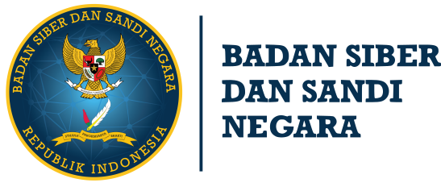

<p align="center"></p>

<p align="center">
<a href="https://travis-ci.org/laravel/framework"></a>
<a href="https://packagist.org/packages/laravel/framework"></a>
<a href="https://packagist.org/packages/laravel/framework"></a>
<a href="https://packagist.org/packages/laravel/framework"></a>
</p>
<br>

## 🤨 Apa itu Indeks KAMI ?

<p align="left"><b>Indeks Keamanan Informasi (KAMI)</b> merupakan aplikasi yang digunakan sebagai alat bantu untuk melakukan asesmen dan evaluasi tingkat kesiapan (Kelengkapan dan Kematangan) penerapan keamanan informasi berdasarkan kriteria SNI ISO/IEC 27001, yaitu Tata Kelola, Pengelolaan Risiko, Kerangka Kerja, Pengelolaan Aset, Aspek Teknologi dengan suplemen Pengamanan Keterlibatan Pihak Ketiga Penyedia Layanan, Pengamanan Layanan Infrastruktur Awan dan Perlindungan Data Pribadi.</p>
<p align="left">Indeks KAMI tidak ditujukan untuk menganalisis kelayakan atau efektivitas bentuk pengamanan yang ada, melainkan sebagai perangkat untuk memberikan gambaran kondisi kesiapan kerangka kerja keamanan informasi.</p>
<br>

## 🌱 Latar belakang terbentuknya Indeks KAMI

<p align="left">Perkembangan teknologi informasi dan komunikasi yang sangat pesat dan disrupsi pola bisnis di era siber yang kini terus terjadi secara dinamis memunculkan risiko dan celah keamanan informasi.</p>
<p align="left">Digitalisasi proses kerja menjadikan keamanan informasi menjadi hal yang berpengaruh pada keseluruhan proses bisnis sehingga sangat penting untuk menjadi perhatian utama.</p>
<p align="left">Keterlibatan pihak ketiga dalam supply chain layanan perusahaan menimbulkan risiko baru. Layanan berbasis cloud memberikan peluang efisiensi dan peningkatan kinerja yang sangat signifikan bagi perusahaan namun juga menimbulkan risiko baru terkait data yang berada pada pengendalian pihak penyelenggara layanan. Beberapa aspek kebutuhan keamanan baru tersebut perlu dimitgasi agar bisnis dapat terus berjalan dengan baik.</p>
<br>

## 📛 Indeks KAMI bukan alat analisis ?

<p align="left">Indeks KAMI tidak ditujukan untuk menganalisis kelayakan atau efektivitas bentuk pengamanan yang ada, melainkan sebagai perangkat untuk memberikan gambaran kondisi kesiapan kerangka kerja keamanan informasi kepada Pimpinan Instansi.</p>
<p align="left">Implementasi Indeks KAMI dilakukan oleh penyelenggara layanan publik secara elektronik melalui Bimbingan Teknis, Asesmen, dan Konsultasi.</p>
<br>

## 🎏 Unduh Index KAMI

<p align="left">Official Indeks KAMI dapat anda unduh di situs resminya BSSN :</p>
- [INDEKS KAMI RESMI](https://bssn.go.id/indeks-kami/)
<br>

## 🎈 Apakah ini Repo resmi milik BSSN ?

<p align="left">Repositori ini <b>BUKAN</b> milik BSSN, Repositori ini berisi Aplikasi hasil dari implementasi Indeks KAMI milik BSSN. Aplikasi dalam repositori ini dibuat menggunakan PHP framework Laravel.</p>
<p align="left">Kami berusaha untuk mengembangkan Aplikasi ini dengan hasil keluaran(output) yang hampir sama dengan Indeks KAMI milik BSSN. Dimana kami berharap Indeks KAMI dapat berjalan melalui web service dengan target platform yang tidak terbatas hanya pada pengguna Microsoft Excel.</p>
<br>

## 🎨 Tujuan dibuatnya Aplikasi ?

<p align="left">Tujuan awal dibuatnya aplikasi ini adalah untuk penelitian dan pembelajaran mahasiswa. Tapi kami juga memiliki harapan untuk menjadikan aplikasi ini sebagai aplikasi resmi BSSN.</p>
<br>

## 🥇 Berkontribusi

<p align="left">Terimakasih kami sampaikan untuk para kontributor yang sudah meluangkan waktu untuk membantu mengembangkan aplikasi ini.</p><br>
<p align="left">Untuk kalian yang ingin ikut berkontribusi dalam aplikasi ini silahkan ikuti langkah - langkah berikut agar Pull Request kalian berhasil :</p>

- Fork [repositori utama aplikasi ini](https://github.com/ifirmawan/indeks-kami).
- Clone repositori yang telah anda fork pada penyimpanan internal komputer kalian ``` git clone https://github.com/yourusername/indeks-kami.git ```
- Buat branch baru dengan nama <i>username</i> Github anda ``` git branch -b yourusername ```
- Setelah selesai menambahkan perubahan, gunakan ``` git add . ```
- Lalu commit dengan pesan diawali huruf Kapital ``` git commit -m "Huruf kapital diawal" ```
- Kalian bisa merge terlebih dahulu ke master dengan perintah ``` git checkout master ``` lalu ``` git merge yourusername ```, atau langsung lakukan PR(Pull Request)
- Lakukan Pull Requet kedalam branch <b>developer</b>, jangan pernah melakukan Pull Request ke dalam branch <b>master</b>.
- Selesai, dan tunggu hingga Maintenancer kami melakukan merge pada Pull Request kalian.

<p align="left">Selamat dan Terimakasih karena telah melakukan Pull Request.</p>
<br>

## 🧨 Kerentanan Keamanan

Bila anda menemukan kerentanan dalam keamanan aplikasi ini, harap buat <i>issue</i> dan deskripsikan kerentanan apa yang anda dapat dari aplikasi ini.
<br>

## 📡 Pemasangan, peluncuran atau Pengembangan

Untuk memulai peluncuran atau pemasang dan pengembangan aplikasi ini, anda bisa melihat [dokumentasi PHP framework Laravel](https://laravel.com/docs) pada situs resminya.
<br>

## 🎁 Lisensi

Lisensi untuk aplikasi ini mengikuti kerangka kerja pembentuknya yaitu PHP framework Laravel : 
The Laravel framework is open-source software licensed under the [MIT license](https://opensource.org/licenses/MIT).
